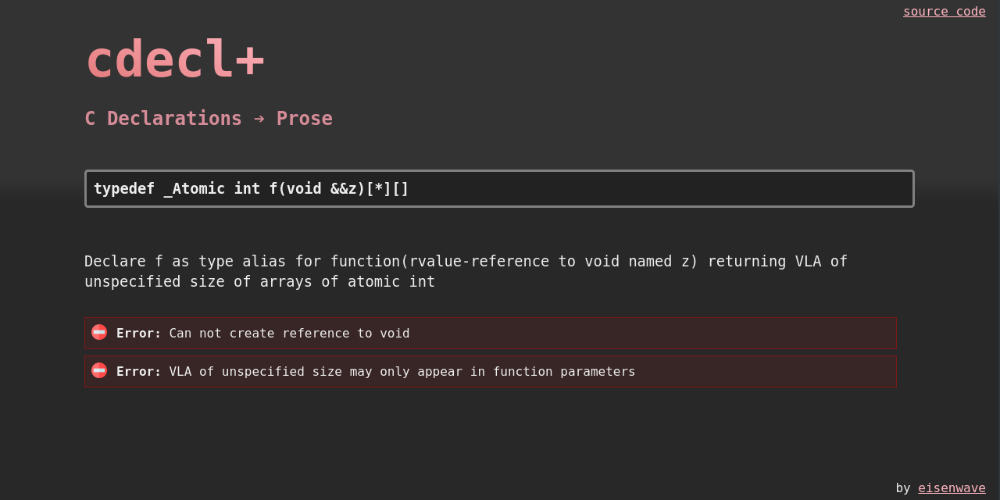

# cdecl+

[](https://eisenwave.github.io/cdecl-plus)

cdecl+ is an online utility written in JavaScript, which turns C declarations into prose.
It is primarily designed for C, but supports some C++ features such as function qualifiers and references.

## Examples
```c
void f(int)
// Declare f as function(int) returning void
```
```c
int(*)[3]
// pointer to array[3] of int
```
```c
const x(int[*]) &
// Declare x as &-qualified function(VLA of unspecified size of int) returning const int
````
```c
typedef struct y {} x
// Declare x as type alias for struct y
```
```c
void (T::*)() const
// pointer to member of T, with type const-qualified function returning void
```

## Architecture & Technologies

cdecl+ uses a PEG.js grammar to generate a JS parser, which is then called by other JavaScript code which converts to prose.
Additional diagnostics are provided, such as errors for syntactically valid, but ill-formed code.

Other than PEG.js, there are no dependencies.
The HTML and CSS are hand-written for this project.
